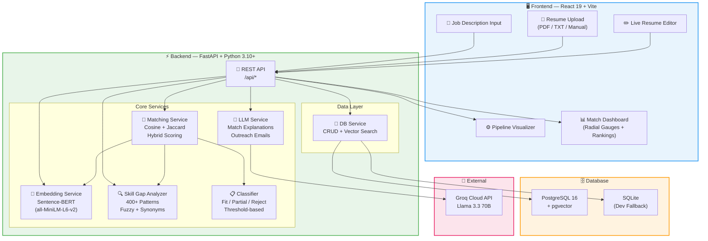
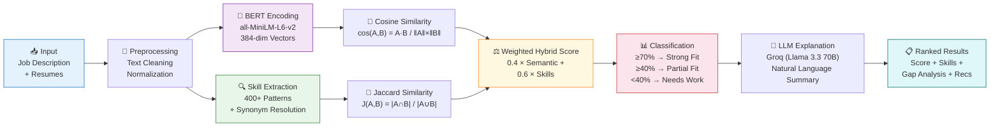
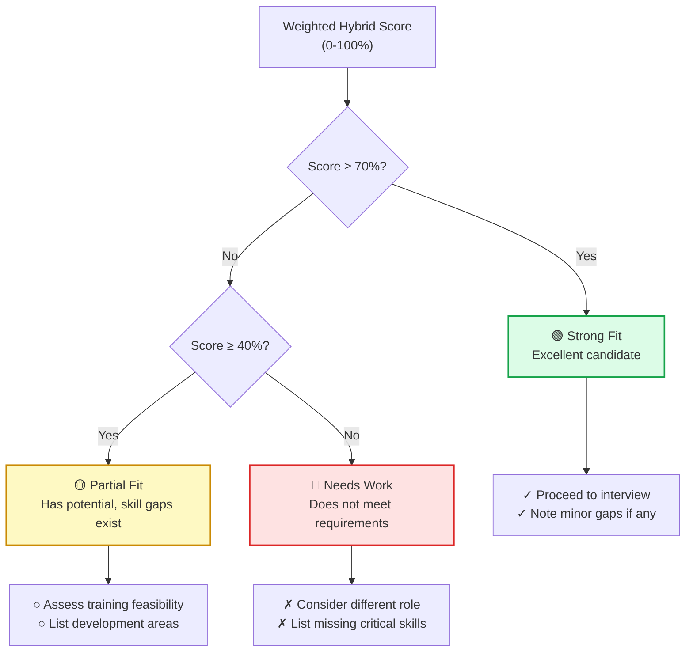
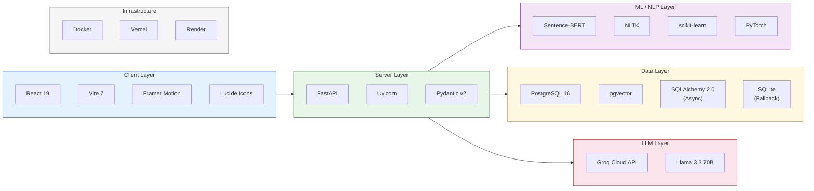

<p align="center">
  <h1 align="center">🎯 Resume-Job Matching System</h1>
  <p align="center">
    An AI-powered Information Retrieval system that semantically matches resumes to job descriptions using <strong>Sentence-BERT embeddings</strong>, <strong>hybrid scoring</strong>, and <strong>LLM-powered explanations</strong>.
  </p>
  <p align="center">
    <strong>Deployed:</strong> Frontend on Vercel | Backend on Render
  </p>
</p>

<p align="center">
  
  
  
  
  
  
</p>

---

## 📋 Table of Contents

- [Overview](#-overview)
- [System Architecture](#-system-architecture)
- [Matching Pipeline](#-matching-pipeline)
- [Key Features](#-key-features)
- [Tech Stack](#-tech-stack)
- [Project Structure](#-project-structure)
- [Getting Started](#-getting-started)
- [API Reference](#-api-reference)
- [How Scoring Works](#-how-scoring-works)
- [IR Concepts Applied](#-ir-concepts-applied)
- [Work Progress](#-work-progress)
- [Future Scope](#-future-scope)
- [Author](#-author)
- [References](#-references)

---

## 🔍 Overview

Modern recruitment is broken — recruiters spend **6-8 seconds per resume**, keyword-based ATS systems miss semantically relevant candidates, and manual screening introduces bias. This project applies **Information Retrieval** techniques to solve that problem.

The system takes a job description and one or more resumes, then:

1. **Encodes** both into 384-dimensional dense vectors using Sentence-BERT
2. **Computes** semantic similarity (cosine) and skill overlap (Jaccard)
3. **Ranks** candidates using a weighted hybrid score
4. **Classifies** each into Strong Fit / Partial Fit / Needs Work
5. **Explains** results using an integrated LLM (Groq Cloud API — Llama 3.3 70B)

---

## 🏗️ System Architecture



---

## 🔄 Matching Pipeline

The end-to-end data flow from user input to ranked results:



---

## 🎯 Classification Decision Flow



---

## ✨ Key Features

| Category | Feature | Description |
|----------|---------|-------------|
| **Core IR** | BERT Embeddings | 384-dim semantic vectors via `all-MiniLM-L6-v2` — understands context, not just keywords |
| **Core IR** | Cosine Similarity | Vector-based content matching for semantic understanding |
| **Core IR** | Jaccard Similarity | Set-based skill overlap calculation |
| **Core IR** | Hybrid Ranking | Weighted scoring: `(Content × 0.4) + (Skills × 0.6)` |
| **NLP** | Skill Extraction | 800+ technical skill patterns with regex matching |
| **NLP** | Fuzzy Matching | Typo tolerance — `"Pytohn"` → `"Python"` |
| **NLP** | Synonym Resolution | `"JS"` → `"JavaScript"`, `"ML"` → `"Machine Learning"` |
| **Classification** | Fit/Partial/Reject | Threshold-based candidate classification with recommendations |
| **LLM** | Match Explanations | Natural language summaries of why a candidate matches |
| **LLM** | Outreach Emails | Auto-generated personalized recruiting emails |
| **LLM** | Interview Questions | Targeted questions based on skill gaps |
| **LLM** | Career Recommendations | Suggest learning paths for candidates |
| **Frontend** | Live Resume Editor | Edit and preview resume text in real-time |
| **Frontend** | Pipeline Visualizer | Real-time step-by-step processing visualization |
| **Frontend** | Radial Gauge Scores | Animated score display with color-coded results |
| **Infra** | Vector Search | pgvector for millisecond similarity search at scale |
| **Infra** | Docker Compose | One-command deployment with PostgreSQL + Backend + Frontend |
| **Infra** | SQLite Fallback | Zero-dependency local development mode |

---

## 🛠️ Tech Stack



| Layer | Technology | Version |
|-------|-----------|---------|
| **Frontend** | React, Vite, Framer Motion, Lucide | 19, 7, 12, 0.563 |
| **Backend** | FastAPI, Uvicorn, Pydantic | 0.109, 0.27, 2.5 |
| **ML/NLP** | Sentence-Transformers, PyTorch, NLTK, scikit-learn | 2.2.2, 2.1.2, 3.8, 1.4 |
| **Database** | PostgreSQL + pgvector, SQLAlchemy (async) | 16, 2.0.25 |
| **File Parsing** | PyPDF2, pdfplumber, python-docx | 3.0, 0.10, 1.1 |
| **LLM** | Groq Cloud API (Llama 3.3 70B), OpenAI-compatible API | Cloud |
| **Infrastructure** | Docker, Vercel (Frontend), Render (Backend) | Cloud |

---

## 📁 Project Structure

```mermaid
graph TD
    ROOT["📦 resume_job_matcher/"]
    
    ROOT --> BE["backend/"]
    ROOT --> FE["frontend/"]
    ROOT --> DC["docker-compose.yml"]
    ROOT --> NG["nginx.conf"]
    ROOT --> ENV[".env.example"]
    ROOT --> PROB["PROBLEM.md"]
    
    BE --> BE_SRC["src/"]
    BE --> BE_DATA["data/"]
    BE --> BE_REQ["requirements.txt"]
    BE --> BE_DOCK["Dockerfile"]
    
    BE_SRC --> MAIN["main.py<br/>App entrypoint + lifespan"]
    BE_SRC --> API_DIR["api/"]
    BE_SRC --> SVC_DIR["services/"]
    BE_SRC --> MDL_DIR["models/"]
    BE_SRC --> CORE_DIR["core/"]
    BE_SRC --> CLS_DIR["classification/"]
    
    API_DIR --> ROUTES["routes.py<br/>All REST endpoints"]
    API_DIR --> SCHEMAS["schemas.py<br/>Pydantic request/response"]
    
    SVC_DIR --> EMB_S["embedding_service.py<br/>BERT singleton"]
    SVC_DIR --> MATCH_S["matching_service.py<br/>Hybrid scoring engine"]
    SVC_DIR --> LLM_S["llm_service.py<br/>Groq Cloud API integration"]
    SVC_DIR --> DB_S["db_service.py<br/>CRUD + vector search"]
    
    CORE_DIR --> CFG["config.py<br/>Pydantic settings"]
    CORE_DIR --> DBMOD["database.py<br/>Async SQLAlchemy + pgvector"]
    
    CLS_DIR --> CLSF["classifier.py<br/>Fit / Partial / Reject"]
    CLS_DIR --> SGAP["skill_gap.py<br/>400+ skill patterns"]
    
    MDL_DIR --> JOB["job.py"]
    MDL_DIR --> RES["resume.py"]
    MDL_DIR --> TASK["task.py"]
    
    BE_DATA --> SKILLS["skills_dataset.json<br/>External skill definitions"]
    
    FE --> FE_SRC["src/"]
    FE --> FE_PKG["package.json"]
    FE_SRC --> APP["App.jsx<br/>Main application"]
    FE_SRC --> APPCSS["App.css<br/>Ceramic Light theme"]
    FE_SRC --> COMP["components/"]
    COMP --> LRE["LiveResumeEditor.jsx"]
    COMP --> MD["MatchDashboard.jsx"]
    COMP --> PV["PipelineVisualizer.jsx"]

    style ROOT fill:#f0f0f0,stroke:#333,stroke-width:2px
    style BE fill:#e8f5e9,stroke:#4CAF50
    style FE fill:#e3f2fd,stroke:#2196F3
    style API_DIR fill:#c8e6c9,stroke:#388E3C
    style SVC_DIR fill:#c8e6c9,stroke:#388E3C
    style CLS_DIR fill:#c8e6c9,stroke:#388E3C
```



```
resume_job_matcher/
├── backend/
│   ├── src/
│   │   ├── main.py                    # FastAPI app entrypoint + lifespan
│   │   ├── api/
│   │   │   ├── routes.py              # All REST API endpoints
│   │   │   └── schemas.py             # Pydantic request/response models
│   │   ├── services/
│   │   │   ├── embedding_service.py   # Sentence-BERT singleton service
│   │   │   ├── matching_service.py    # Hybrid scoring: cosine + jaccard
│   │   │   ├── llm_service.py         # Groq Cloud API / Llama 3.3 70B integration
│   │   │   └── db_service.py          # Database CRUD + vector search
│   │   ├── classification/
│   │   │   ├── classifier.py          # Fit / Partial / Reject classification
│   │   │   └── skill_gap.py           # 800+ skill patterns, fuzzy match, synonyms
│   │   ├── models/
│   │   │   ├── job.py                 # Job SQLAlchemy model
│   │   │   ├── resume.py             # Resume SQLAlchemy model
│   │   │   └── task.py               # Background task model
│   │   └── core/
│   │       ├── config.py             # Pydantic settings (env vars)
│   │       └── database.py           # Async SQLAlchemy + pgvector setup
│   ├── data/
│   │   └── skills_dataset.json       # External skills definitions
│   ├── test_50_cases.py              # 50-case comprehensive test suite
│   ├── requirements.txt
│   └── Dockerfile                    # Cloud-ready (pre-downloads BERT)
├── frontend/
│   ├── src/
│   │   ├── App.jsx                   # Main application component
│   │   ├── App.css                   # Obsidian/Crystal design system
│   │   ├── components/
│   │   │   ├── LiveResumeEditor.jsx  # Real-time resume text editor
│   │   │   ├── MatchDashboard.jsx    # Results with radial gauges
│   │   │   └── PipelineVisualizer.jsx # Step-by-step processing view
│   │   ├── index.css
│   │   └── main.jsx
│   ├── vercel.json                   # Vercel deployment config
│   ├── package.json
│   └── vite.config.js
├── render.yaml                       # Render backend deployment config
├── docker-compose.yml                # Full-stack orchestration (local)
├── .env.example                      # Environment variable template
├── PROBLEM.md                        # Problem statement & IR concepts
└── .gitignore
```

---

## 🚀 Getting Started

### Prerequisites

- **Python** 3.10+
- **Node.js** 18+
- **Groq API Key** (free at [console.groq.com](https://console.groq.com)) — optional, for LLM features

### Option 1: Cloud Deployment (Recommended)

#### Backend → Render (Free Tier)

1. Go to [render.com](https://render.com) → **New Web Service**
2. Connect your GitHub repo
3. Set **Root Directory**: `backend`
4. Set **Runtime**: Docker
5. Add environment variables:
   - `USE_SQLITE=true`
   - `CORS_ORIGINS=*`
   - `LLM_API_KEY=your_groq_key`
6. Deploy → note your URL (e.g., `https://resume-matcher-api.onrender.com`)

#### Frontend → Vercel

1. Go to [vercel.com](https://vercel.com) → **Import Project**
2. Set **Root Directory**: `frontend`
3. Set **Framework**: Vite
4. Add environment variable:
   - `VITE_API_URL=https://your-render-backend-url.onrender.com`
5. Deploy

> ⚠️ **Why not Vercel for backend?** PyTorch + BERT model is ~500MB, exceeding Vercel's 250MB serverless limit. Render's Docker support handles this.

### Option 2: Local Development

#### Backend

```bash
cd backend

# Create and activate virtual environment
python -m venv venv
venv\Scripts\activate        # Windows
# source venv/bin/activate   # Linux/Mac

# Install dependencies
pip install -r requirements.txt

# Configure environment
copy .env.example .env
# Edit .env with your settings (USE_SQLITE=true for local dev)

# Run the server
uvicorn src.main:app --reload --port 8000
```

#### Frontend

```bash
cd frontend

# Install dependencies
npm install

# Start development server
npm run dev
# Open http://localhost:5173
```

### Option 3: Docker Compose (Local)

```bash
git clone https://github.com/your-username/resume-job-matcher.git
cd resume-job-matcher
docker-compose up -d

# Frontend: http://localhost:3000
# Backend API Docs: http://localhost:8000/docs
```

### Environment Variables

Create a `.env` file in `backend/`:

```env
# Database (use SQLite for quick local dev)
USE_SQLITE=true

# LLM Configuration (Groq Cloud — free key at console.groq.com)
LLM_API_URL=https://api.groq.com/openai/v1
LLM_API_KEY=your_groq_api_key_here
LLM_MODEL=llama-3.3-70b-versatile
LLM_ENABLED=true

# CORS — use * for cloud, or comma-separated URLs
CORS_ORIGINS=http://localhost:5173,http://localhost:3000

# Application
DEBUG=true
```

---

## 🔌 API Reference

| Endpoint | Method | Description |
|----------|--------|-------------|
| `/api/health` | `GET` | System health check with component status |
| `/api/manual-match` | `POST` | Match resumes against a job description |
| `/api/extract-skills` | `POST` | Extract skills from any text |
| `/api/upload-file` | `POST` | Parse PDF/TXT files to extract text |
| `/api/upload-resume` | `POST` | Upload and store a resume in the DB |
| `/api/jobs` | `GET/POST` | List or create job postings |
| `/api/jobs/{id}` | `GET/DELETE` | Get or delete a specific job |
| `/api/resumes` | `GET/POST` | List or create resumes |
| `/api/resumes/{id}` | `DELETE` | Delete a resume |
| `/api/jobs/{id}/rank` | `GET` | Rank stored resumes for a job |
| `/api/skill-gap` | `POST` | Analyze skill gaps between resume & job |
| `/api/llm/status` | `GET` | Check LLM service availability |
| `/api/llm/configure` | `POST` | Update LLM settings |
| `/api/llm/outreach-email` | `POST` | Generate personalized outreach email |
| `/api/seed-data` | `POST` | Seed database with sample data |

### Example: Match Resumes

```bash
curl -X POST "http://localhost:8000/api/manual-match" \
  -H "Content-Type: application/json" \
  -d '{
    "job_description": "Senior Python Developer with Django, PostgreSQL, and Docker experience",
    "resumes": [
      {"name": "Alice", "content": "5 years Python, Django, PostgreSQL, Docker, AWS"},
      {"name": "Bob", "content": "Frontend developer with React, JavaScript, CSS"}
    ]
  }'
```

### Example Response

```json
{
  "job_skills_detected": ["python", "django", "postgresql", "docker"],
  "results": [
    {
      "name": "Alice",
      "score": 0.85,
      "content_similarity": 0.72,
      "skill_similarity": 1.0,
      "classification": {
        "level": "fit",
        "label": "Strong Match",
        "color": "#22c55e"
      },
      "matched_skills": ["python", "django", "postgresql", "docker"],
      "missing_skills": [],
      "skill_gap": {
        "coverage": 100.0,
        "critical_missing": [],
        "recommendations": ["✓ Strong candidate - consider for interview"]
      }
    },
    {
      "name": "Bob",
      "score": 0.22,
      "classification": {
        "level": "reject",
        "label": "Low Match",
        "color": "#ef4444"
      },
      "matched_skills": [],
      "missing_skills": ["python", "django", "postgresql", "docker"]
    }
  ]
}
```

---

## 📐 How Scoring Works

### Scoring Formula

```
Final Score = (α × Content Similarity) + (β × Skill Similarity)
```

Where:
- **α = 0.4** — Semantic content similarity weight (BERT cosine similarity)
- **β = 0.6** — Skill overlap weight (skills are weighted higher for technical roles)

### Component Details

| Component | Method | What It Captures |
|-----------|--------|-----------------|
| **Content Similarity** | Cosine similarity on BERT embeddings | Semantic meaning — "React developer" ≈ "Frontend engineer" |
| **Skill Similarity** | Jaccard-like overlap on extracted skills | Explicit skill requirements — exact match with fuzzy tolerance |

### Classification Thresholds

| Score Range | Classification | Color | Action |
|:-----------:|:--------------|:-----:|--------|
| **≥ 70%** | 🟢 Strong Fit | Green | Proceed to interview |
| **≥ 40%** | 🟡 Partial Fit | Amber | Assess training feasibility |
| **< 40%** | 🔴 Needs Work | Red | Consider different role |

---

## 📚 IR Concepts Applied

| # | IR Concept | Implementation | Why It Matters |
|---|-----------|---------------|----------------|
| 1 | **Document Representation** | Sentence-BERT (384-dim dense vectors) | Captures semantic meaning, not just word counts |
| 2 | **Dense Retrieval** | Neural embeddings via `all-MiniLM-L6-v2` | `"Java developer"` ≈ `"Backend engineer"` |
| 3 | **Cosine Similarity** | `cos(A,B) = A·B / (‖A‖×‖B‖)` | Scale-invariant similarity for any text length |
| 4 | **Set-based Matching** | Jaccard similarity on skill sets | Precise skill overlap measurement |
| 5 | **Ranked Retrieval** | Weighted hybrid scoring with sorting | Best candidates always surface first |
| 6 | **Query Expansion** | Synonym mapping + fuzzy matching | `"JS"` → `"JavaScript"`, `"Pytohn"` → `"Python"` |
| 7 | **Vector Search** | pgvector cosine distance operator (`<=>`) | Sub-millisecond search over millions of vectors |
| 8 | **Classification** | Threshold-based Fit/Partial/Reject | Actionable categorization for recruiters |

---

## 📈 Work Progress

### ✅ Completed

- [x] **Backend Architecture** — FastAPI async application with lifespan management
- [x] **Sentence-BERT Integration** — Singleton embedding service with `all-MiniLM-L6-v2` model
- [x] **Matching Engine** — Hybrid cosine + Jaccard scoring with configurable weights
- [x] **Skill Extraction** — 800+ skill patterns covering languages, frameworks, databases, cloud, DevOps, ML, and soft skills
- [x] **Fuzzy Matching** — Typo-tolerant skill recognition using `SequenceMatcher` with 0.85 threshold
- [x] **Synonym Resolution** — Comprehensive synonym mapping (JS→JavaScript, ML→Machine Learning, etc.)
- [x] **Candidate Classification** — Three-tier classification (Fit ≥70%, Partial ≥40%, Reject <40%)
- [x] **Skill Gap Analysis** — Critical vs. nice-to-have skills with actionable recommendations
- [x] **LLM Integration** — Groq Cloud API (Llama 3.3 70B) for match explanations, outreach emails, interview questions, career recs
- [x] **Database Layer** — PostgreSQL + pgvector with SQLite fallback, async SQLAlchemy 2.0
- [x] **REST API** — 15+ comprehensive endpoints with Pydantic validation
- [x] **PDF Parsing** — PyPDF2 + pdfplumber dual-engine extraction with text cleaning
- [x] **React Frontend** — React 19 with Framer Motion animations and Ceramic Light theme
- [x] **Live Resume Editor** — Real-time text editing with skill extraction preview
- [x] **Pipeline Visualizer** — Step-by-step processing animation (embed → match → classify → explain)
- [x] **Match Dashboard** — Radial gauge scores, skill badges, expandable details
- [x] **Docker Deployment** — Full docker-compose with PostgreSQL, backend, and frontend containers
- [x] **Cloud Deployment** — Frontend on Vercel, Backend on Render (Docker with BERT pre-download)
- [x] **API Documentation** — Auto-generated Swagger UI and ReDoc at `/docs` and `/redoc`
- [x] **Background Tasks** — Async processing for heavy operations + sample data seeding
- [x] **Comprehensive Testing** — 50-case test suite covering 8 JD types × 12 resume profiles = 100% pass rate

### 🔮 Planned

- [ ] User feedback loop for ranking improvement (relevance feedback)
- [ ] Multi-language resume support
- [ ] Job clustering with K-Means
- [ ] Recommendation engine (suggest jobs to candidates)
- [ ] Analytics dashboard with recruitment metrics
- [ ] Interview scheduling integration

---

## 🧪 Test Results (50 Cases)

The backend has been validated with a comprehensive 50-case test suite (`backend/test_50_cases.py`) covering:

| Category | Cases | Pass Rate | Description |
|----------|-------|-----------|-------------|
| Health & Infrastructure | 1-5 | **5/5** | Health check, root endpoint, LLM status, Swagger docs, 404 handling |
| Skill Extraction | 6-15 | **10/10** | Python, Frontend, DS, DevOps, Mobile, edge cases, synonyms |
| Perfect Matches | 16-21 | **6/6** | Domain-matched candidates score **78-88%** (Strong Match) |
| Cross-Domain Mismatches | 22-26 | **5/5** | Wrong-domain candidates score **9-20%** (Low Match) |
| Multi-Resume Ranking | 27-31 | **5/5** | Correct ordering of 4-5 candidates by relevance |
| Partial Matches | 32-36 | **5/5** | Adjacent-domain candidates score **42-67%** (Potential Match) |
| Edge Cases | 37-40 | **4/4** | Junior devs, overqualified CTOs, career changers |
| Full Rankings (12 candidates) | 41-42 | **2/2** | All 12 resume profiles ranked correctly |
| Specific Overlaps | 43-45 | **3/3** | Partial skill overlap scenarios |
| Stress Tests | 46-50 | **5/5** | Duplicates, weak-only pools, strong-competing |
| **Total** | **50** | **100%** | |

### Sample Ranking Output

**Full-Stack JD → 5 Candidates:**
```
1. Alice_Perfect  = 79%  (Strong Match,   14/17 skills matched)
2. Bob_Backend    = 67%  (Potential Match, 10/17 skills matched)
3. Carol_Frontend = 39%  (Low Match,        4/17 skills matched)
4. Grace_Junior   = 32%  (Low Match,        4/17 skills matched)
5. David_Analyst  = 28%  (Low Match,        2/17 skills matched)
```

**Run tests locally:**
```bash
# Start backend first, then:
python backend/test_50_cases.py
```

---

## 🔮 Future Scope

| Enhancement | Description |
|------------|-------------|
| **Relevance Feedback** | User ratings to continuously improve ranking quality |
| **Multi-Language** | Support for resumes in different languages |
| **Job Clustering** | K-Means clustering to group similar job postings |
| **Candidate Recommendations** | Suggest suitable jobs to candidates |
| **Analytics Dashboard** | Recruitment metrics, pipeline insights, and trends |
| **Interview Scheduling** | Calendar API integration for automated scheduling |

---

## 🎨 UI Theme

The frontend uses a **Ceramic Light** design system:

| Property | Value |
|----------|-------|
| Background | Warm off-white `#faf9f7` |
| Cards | White with soft box shadows |
| Accent | Violet `#7c3aed` |
| Success | Green `#22c55e` |
| Warning | Amber `#f59e0b` |
| Error | Red `#ef4444` |
| Font | Inter (Google Fonts) |
| Animations | Framer Motion with spring physics |

---

## 👤 Author

**Raj Kumar**  
Information Retrieval — Semester VI  
February 2026

---

## 📚 References

1. Reimers, N., & Gurevych, I. (2019). *Sentence-BERT: Sentence Embeddings using Siamese BERT-Networks*. [arXiv:1908.10084](https://arxiv.org/abs/1908.10084)
2. Sentence Transformers Documentation: [sbert.net](https://www.sbert.net/)
3. pgvector — Open-source vector similarity search for PostgreSQL: [github.com/pgvector/pgvector](https://github.com/pgvector/pgvector)
4. FastAPI Documentation: [fastapi.tiangolo.com](https://fastapi.tiangolo.com/)
5. Groq Cloud API — High-speed LLM inference: [groq.com](https://groq.com)
6. Vercel — Frontend deployment platform: [vercel.com](https://vercel.com)
7. Render — Cloud application hosting: [render.com](https://render.com)

---

<p align="center">
  Made with ❤️ for the Information Retrieval Course
</p>
